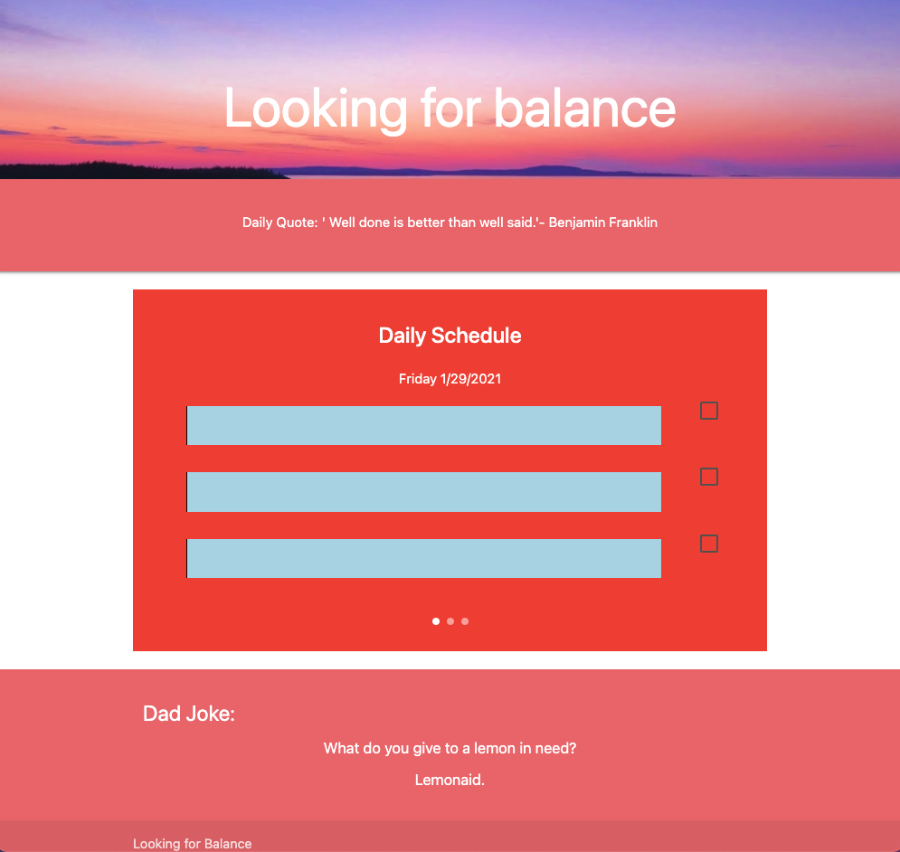

# Looking-for-Balance
Finding Balance in a Busy Life

Creating a website to allow you to prioritze your time, stay on track and balanced.

We needed to create an html, framework  was materialzecss, and javascript file.

We needed to display an input field to input our daily task goals in each bucket

We needed to add check mark button to note completion of each

We are using simply 3 important things in each bucket to make your daily goals attainable 

We also added an inspirational daily quote at the top of the page to give you a nice encouraging message when opening the page

We added a dad joke at the bottom of the page for a good laugh when you need it that can be refreshed 

Other resources used were w3school, mozilla, and youtube

Below is a screen shot of the weather app online

Below is a link to the repository 
https://github.com/HectorDiazJr/Looking-for-Balance

Below is al link to the web page 
https://hectordiazjr.github.io/Looking-for-Balance/
